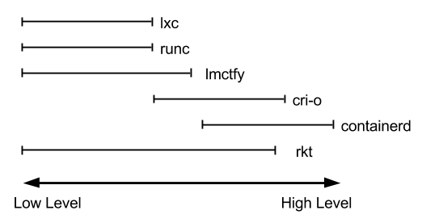
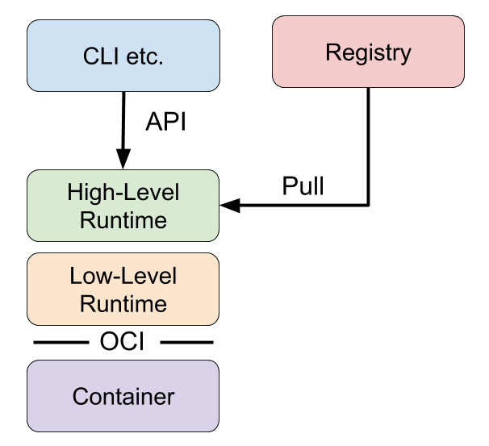

# CNI  <small>(container runtime interface)</small>

&emsp;&emsp;今天我们来讲一下 *Kubernetes* 中非常重要的一个模块： *CNI* , *CNI* 是 *container runtime interface* 的简称，看名字我们可以看出和 *container runtime* 有很大的关系，所以为了更好的理解 *CNI*， 我们先讲一下 *container runtime*。

## 什么是 *container runtime*

&emsp;&emsp;如果熟悉编程的应该对 *"runtime"* 这个词不会陌生，通常来说， *runtime* 既可以指程序运行的声明周期，也可以表示编程语言执行过程的内部实现。而对于 *container runtime* 来说，和后者的定义更为类似，指的是容器运行的具体实现。接下来我们要说的各种 *container runtime*， 可能不仅仅包含如何运行容器，但是需要记住， *container runtime*的一开始的作用就是能够运行容器。

&emsp;&emsp;但是你如果在网上试着了解 *container runtime*， 你会发现有很多的争论，也有很多让人疑惑的地方，其中最大的问题是**究竟什么是真正的 *container runtime***？产生这些问题的原因是因为 *container runtime*的历史遗留。

&emsp;&emsp;了解容器发展的人应该知道，容器的成功与 *Docker* 的发布有着密不可分的关系。*Docker* 在2013年发布之后，解决了端到端的开发的很多问题， 比如：
* 统一的运行环境 (镜像格式)
* 基于镜像运行容器的方法  (Dockerfile/docker build)
* 镜像的管理 (docker images, docker rmi...)
* 容器的管理 (docker ps, docker rm...)
* 镜像的共享 (docker push/pull)
* 运行容器 (docker run)

&emsp;&emsp;这个时候的 *Docker* 是一个体积庞大的系统，对于其他系统想要使用 *Docker*， 就必须使用 *Docker* 的全部功能，这显然不是很友好，那么能不能将 *Docker* 里面的模块拆分出来呢？答案是肯定的，首先从上面的功能可以看出，每个模块基本都是独立的，对其他模块的依赖并不是很高，而且功能也没有太多重叠。所以基于此，*Docker*, *Google*, *CoreOS*等公司就成立了 *Open Container Intiative(OCI)* 组织，指定镜像和容器的一下标准，所以在一些 *container runtime* 中我们会看到 *"符合OCI标准"* 的字样。然后 *Docker*将其中运行容器的部分拿了出来并贡献给了 *OCI* 作为 *runtime spec* 的具体实现，也就是 *runc*， 这就是 *container runtime* 的由来。

&emsp;&emsp;到这问题开始出来了， *Docker* 贡献的只有 “运行容器”， 其他的并没有贡献出来，像镜像的格式、仓库推送拉取的格式等等。而且更为重要的是， *Docker* 并没有贡献“运行容器”的全部内容。一般来说，运行一个容器的过程分为三步:

* 下载或寻找镜像
* 解压镜像到系统中
* 从刚才解压的文件上运行容器

&emsp;&emsp;你可能想到了， *Docker* 只贡献了第三部的标准，一开始所有人都认为 *container runtime*应该支持 *Docker*的全部功能，所以最终 *Docker* 不得不更改声明， *container runtime*仅仅指 “运行容器”。这个也就是争论的由来，对于 *container runtime*是应该仅支持运行容器还是包含更多，不同的人有不同的说法，双方都没有错，所以对于什么是 *container runtime* 究竟是什么，你的看法是什么呢？

&emsp;&emsp;基于是支持容器的运行还是其他的功能，我们将 *container runtime*分成两种：Low-Leve了和 High-Level。

### Low-Level

&emsp;&emsp;我们知道容器是基于 *Linux namespaces* 和 *cgroups* 来实现的。 *namespaces* 进行系统资源的虚拟化， *cgroups* 来限制资源的使用。所以 *Low-Level* 的 *container runtime* 就负责容器运行的 *namespaces* 和 *cgroups*， 以及在这些 *namespaces* 和*cgroups* 中运行相应的命令。所以 *Low-Level* 主要指处理系统层面的功能。

### High-Level

&emsp;&emsp;那么对于 *High-Level* 的 *container runtime*，负责的是更为高级的容器功能，比如镜像的传输和管理，镜像的解压然后供 *Low-Level* 的 *container runtime* 使用。通常， *High-Level* 的 *container runtime* 提供了一个守护进程，供远程程序来运行容器和查看容器状态。当然有些 *High-Level* 的 *container runtime* 提供了和 *Low-Level* 类似的功能，但是这些功能可以跨容器使用，比如管理 *Network namepsaces*，是的容器可以加入另一个容器的网络。

&emsp;&emsp;下面是他们之间的关系：

## Container Runtime Interface

&emsp;&emsp;下面进入正题，随着*Kubernetes*的发展，很多人希望 *Kubernetes* 可以支持更多的 *container runtime*, 这样对于容器引擎就会有更多的选择。所以 *Kubernetes* 就推出了 *CRI* 这个插件。

&emsp;&emsp;*CRI* 是一个能让 *kubelet* 无需编译就可以支持多种容器运行时的插件接口。CRI包含了一组 *protocol buffers*，*gRPC API*和相关的库，以及在活跃开发下的额外规范和工具。这样的好处在于各种 *container runtime* 无需编入 *kubelet* 源码就可以被 *Kubernetes* 使用。

&emsp;&emsp;*CRI* 的架构如下：

&emsp;&emsp;从上面来看，*Kubelet* 和 *container runtime*进行通信时，*Kubelet* 作为客户端， *CRI*作为服务端，双方通过 *protocol buffers* 进行通信（unix套接字或者gRPC框架）。而 *protocol buffers API*中主要包含了两个服务: *ImageService* 和 *RuntimeService*， 其中 *ImageService* 主要针对镜像，包括镜像的拉取，查看和删除。 *RuntimeService* 主要是针对 *Pod* 和容器， 包括Pod的运行，删除，查看和容器的创建，运行，删除等。所以 *container runtime* 只需要实现对应的接口并提供相应的该服务就可以了。

比如 *containerd* ：

目前云原生的 *container runtime*可以在CNCF官网查询，如下面所示：

而下面是一些支持CRI的 *"container runtime"*：

* Docker
* CRI-O
* Containerd
* frakti
* rktlet

## 参考

* [Container Runtimes](https://www.ianlewis.org/en/container-runtimes-part-1-introduction-container-r)

* [Kubernetes(k8s)容器运行时(CRI)简介](https://www.kubernetes.org.cn/1079.html)